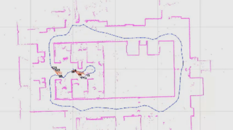

# Seminars_Artificial_Intelligence
This repo highlights the most important aspects of the AI seminars topics, followed during the Master Thesis in Sapienza. 

In particular I wrote this report about two topics that interested me most, among all of them (about 10 seminars were attended).

The first is about "Decision Making with Temporal Goals": my work consisted on analysis and reproduction of experiments with final related discussion.

The second report is about "Least Square SLAM": my work consisted on a deep analysis of the topic, searching and discussing further documentation.

